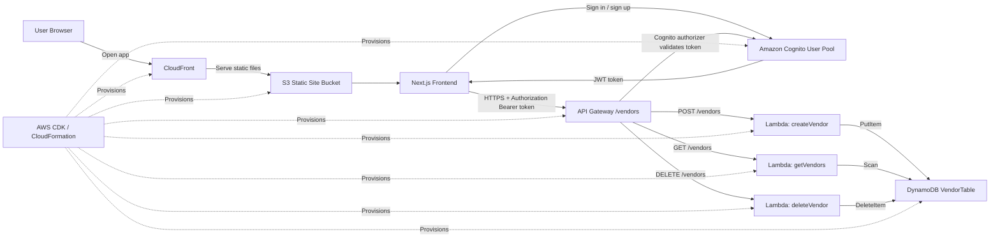

# Architecture Diagram

This diagram shows the main runtime flow for Vendor Tracker and the infrastructure layer that provisions it.

## Notes

- CloudFront serves the static frontend files from S3 over HTTPS.
- Cognito handles user sign-up, sign-in, and token issuance.
- API Gateway protects the `/vendors` routes with a Cognito authorizer.
- Lambda functions contain the application logic for creating, reading, and deleting vendors.
- DynamoDB stores vendor records keyed by `vendorId`.
- CDK defines the infrastructure and deploys it through CloudFormation.
